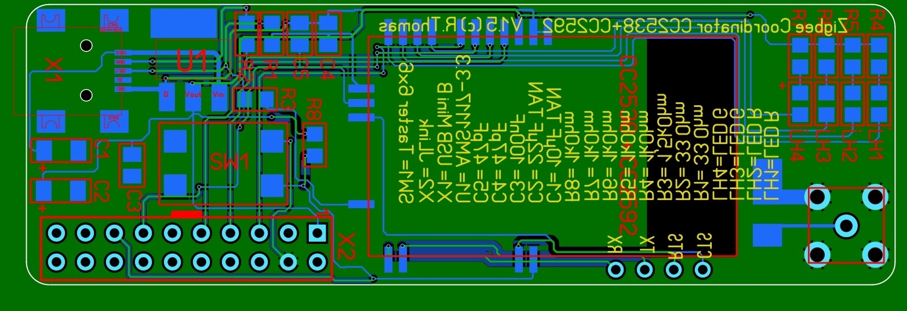
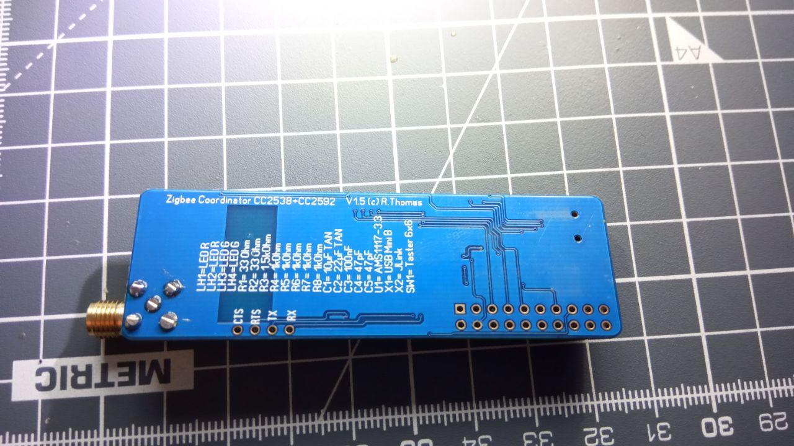

## Zigbee 3 Usb Stick

CC2538-CC2592 Modul  

## Solftware

[CC2538-ZNP-Coordinator-firmware](https://github.com/antst/CC2538-ZNP-Coordinator-firmware)  
CC2538-CC2592.hex zum Flashen nutzen.

## Hardware zum Flashen

[J-Link Amazon](https://www.amazon.de/gp/product/B07X1MX1V8/ref=ppx_yo_dt_b_asin_title_o03_s00?ie=UTF8&psc=1)  
[J-Link Ebay](https://www.ebay.de/itm/Arm7-Arm9-Arm11-J-Link-V8-Emulator-Cortex-M3-Iar-Stm32-Jtag-Schnittstelle-HH/163864510350?_trkparms=ispr%3D1&hash=item262715ff8e:g:Ex4AAOSwYIxX-8DR&enc=AQAEAAACQBPxNw%2BVj6nta7CKEs3N0qXpZ599mDcM1VT%2BkHZD25Up4pSosuLwoMi%2F8h7WNfvZ16oyIaeDtt1H9o3NmI0dQmfRZ%2BgEr%2BweaRZzSk9W29iu9KDY%2FqSSSpI%2FwlhiyD6sTsHm8lDOLJld%2B%2BStjyhJOtU1y6kwBVfvOOyyn0VOjXe5jBWBL2gyuXcfWDBHc56P1KCgDqap7DzlGTlNjIHA5spEjUDerZUq3VWSZa%2Fmo0AtSjWZPlE7o96%2FPz51%2FsiaRHkuJRngGPhi7PeHVmWPKqBgxh1nZSLatCvEZ%2FBeSuQxjrUOPJOHytKi0OgZ4qiazSNhYRTarPHI4EObR7K6sgtDrZ1UiRi9OW5nSImJDW%2BpWy7MVhqXuPMqRJx2OFNsfPBaYKYePpIihRLvNMrDWFiFvhMs4wvcwwwXqgqD3%2BymOATIr5TKw%2FDbdVQKSflYkVVmbzjF2KwzZx%2FnTnuXKz9J8FMga4Pl7SCRW63qyYiQVpm8Yc4eUywfM40okKDSp%2Fng6z5ffjqtskF5J448PNERNJKDSzKKzCfZrG5XL6mYMlT6tsYGTHvN8FvZPIeVGTN42nPwTUCm4rOofLohA26vCVxAfd2wm4uCy78wHVs3k7k%2F1EKZcqfWub9%2FPBrknObgJjCN5hSXm0%2FrJQBwc5YyvsZXJpQEbO1vsY%2FeH5F1eAWLL8J1%2BBkLHg8yE6xgnHn7EnwuwGgO1aywm9lGwcI0K6ktR5F9qsyLErOczfPMJKqpIenFo4BEfaF%2B9KoyJQ%3D%3D&checksum=163864510350ce0eb5585b65496492385a94dd28cb04&enc=AQAEAAACQBPxNw%2BVj6nta7CKEs3N0qXpZ599mDcM1VT%2BkHZD25Up4pSosuLwoMi%2F8h7WNfvZ16oyIaeDtt1H9o3NmI0dQmfRZ%2BgEr%2BweaRZzSk9W29iu9KDY%2FqSSSpI%2FwlhiyD6sTsHm8lDOLJld%2B%2BStjyhJOtU1y6kwBVfvOOyyn0VOjXe5jBWBL2gyuXcfWDBHc56P1KCgDqap7DzlGTlNjIHA5spEjUDerZUq3VWSZa%2Fmo0AtSjWZPlE7o96%2FPz51%2FsiaRHkuJRngGPhi7PeHVmWPKqBgxh1nZSLatCvEZ%2FBeSuQxjrUOPJOHytKi0OgZ4qiazSNhYRTarPHI4EObR7K6sgtDrZ1UiRi9OW5nSImJDW%2BpWy7MVhqXuPMqRJx2OFNsfPBaYKYePpIihRLvNMrDWFiFvhMs4wvcwwwXqgqD3%2BymOATIr5TKw%2FDbdVQKSflYkVVmbzjF2KwzZx%2FnTnuXKz9J8FMga4Pl7SCRW63qyYiQVpm8Yc4eUywfM40okKDSp%2Fng6z5ffjqtskF5J448PNERNJKDSzKKzCfZrG5XL6mYMlT6tsYGTHvN8FvZPIeVGTN42nPwTUCm4rOofLohA26vCVxAfd2wm4uCy78wHVs3k7k%2F1EKZcqfWub9%2FPBrknObgJjCN5hSXm0%2FrJQBwc5YyvsZXJpQEbO1vsY%2FeH5F1eAWLL8J1%2BBkLHg8yE6xgnHn7EnwuwGgO1aywm9lGwcI0K6ktR5F9qsyLErOczfPMJKqpIenFo4BEfaF%2B9KoyJQ%3D%3D&checksum=163864510350ce0eb5585b65496492385a94dd28cb04)

## Anleitung zum Flashen

[Howto](https://github.com/ronnythomas/Zigbee-3-Stick-CC2538-2592/tree/master/Images/JLink-Flashen.pdf)

## Teileliste

| Pos  | Menge   | Wert      | Bauform  | Bemerkung | Link |
| ---   | ---  | ---       | ---      | ---       | --- |
| LH1/LH2 | 2 | LED Rot| 0805 | | [Link](https://www.reichelt.de/led-smd-2012-0805-gelb-8-mcd-120-smd-led-0805-ge-p31437.html?&trstct=pos_1&nbc=1)
| LH3/LH4 | 2 | LED Grün| 0805 | | [Link](https://www.reichelt.de/led-smd-2012-0805-gruen-12-mcd-120-smd-led-0805-gn-p31436.html?&trstct=pos_0&nbc=1)
| R1/R2 |2 | 33Ohm |0805 | | [Link](https://www.reichelt.de/smd-widerstand-0805-33-ohm-125-mw-1-smd-0805-33-0-p32868.html?&trstct=pos_0&nbc=1)
| R3 |1 | 1,5kOhm |0805 | | [Link](https://www.reichelt.de/smd-widerstand-0805-1-5-kohm-125-mw-1-rnd-0805-1-1-5k-p183232.html?&trstct=pos_0&nbc=1)
| R4-8 | 5 | 1kOhm |0805 | | [Link](https://www.reichelt.de/smd-widerstand-0805-1-0-kohm-125-mw-1-rnd-0805-1-1-0k-p183228.html?&trstct=pos_0&nbc=1)
| C1 | 1 | 10µF |3,2x1,6 | Tantalkondensator | [Link](https://www.reichelt.de/smd-tantal-10-f-6v-125-c-t491a-10u-6-p206440.html?&trstct=pol_9&nbc=1)
| C2 | 1 | 22µF |3,5x2,8 | Tantalkondensator | [Link](https://www.reichelt.de/smd-tantal-22-f-6v-125-c-t494b-22u-6-p206511.html?&trstct=pol_12&nbc=1)
| C3 | 1 | 100nf |0805 | | [Link](https://www.reichelt.de/vielschicht-kerko-100nf-50v-125-c-kem-x7r0805-100n-p207073.html?&trstct=pol_0&nbc=1)
| C4/5 | 2 | 33pf |0805 | | [Link](https://www.reichelt.de/smd-kerko-0805-33-pf-50-v-5-mlcc-rnd-1500805n3302-p226103.html?&trstct=pol_0&nbc=1)
| U1 | 1 | 3,3V LDO | SOT-223 | | [Link](https://www.reichelt.de/ldo-regler-fest-3-3-v-sot-223-ncp-1117-st33t3g-p188925.html?&trstct=pos_10&nbc=1)
| X1 | 1 | mini Usb |  | | [Link](https://www.reichelt.de/usb-einbaubuchse-b-mini-gew-smd-montage-usb-bwm-smd-p52003.html?&trstct=pol_12&nbc=1)
| X2 | 1 | mini Usb |  | | [Link](https://www.reichelt.de/usb-einbaubuchse-b-mini-gew-smd-montage-usb-bwm-smd-p52003.html?&trstct=pol_12&nbc=1)
| SW1 | 1 | |  | Anschluss JLink| [Link](https://www.reichelt.de/stiftleisten-2-54-mm-2x10-gerade-mpe-087-2-020-p119898.html?r=1)
| Sma Anschluss | 1 | |  | nur bei externer Antenne| [Link Buchse](https://de.aliexpress.com/item/4000010110929.html?spm=a2g0s.9042311.0.0.683d4c4dCiU6km) [Link Stecker](https://de.aliexpress.com/item/32876812319.html?spm=a2g0s.9042311.0.0.27424c4dboNjWv)
| RG178 Kabel | 1 | |  | Anschlusskabel externe Antenne | [Link](https://de.aliexpress.com/item/32981172826.html?spm=a2g0o.productlist.0.0.1eba5b955jeuxe&algo_pvid=6a8bf0cb-5462-437d-a016-634d323400ef&algo_expid=6a8bf0cb-5462-437d-a016-634d323400ef-0&btsid=ff874e91-83d0-4512-aec3-596f8bb1fa6b&ws_ab_test=searchweb0_0,searchweb201602_10,searchweb201603_55)

[Reichelt Warenkorb ohne externe Antenne](https://www.reichelt.de/my/1670772) Teilepreis ca.2,60€ 
[CC2538 + CC2592 PA Zigbee Wireless Modul](https://de.aliexpress.com/item/32880588264.html?spm=a2g0s.9042311.0.0.683d4c4dw2suLa)

